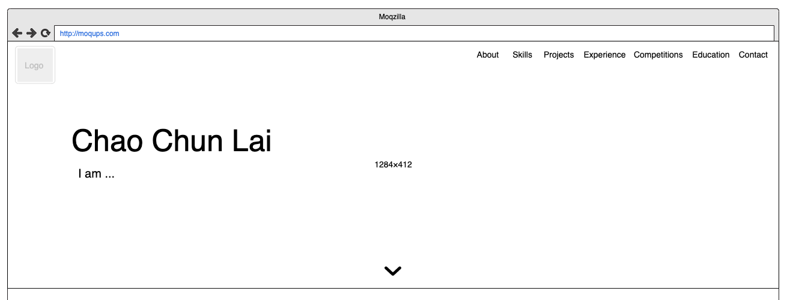
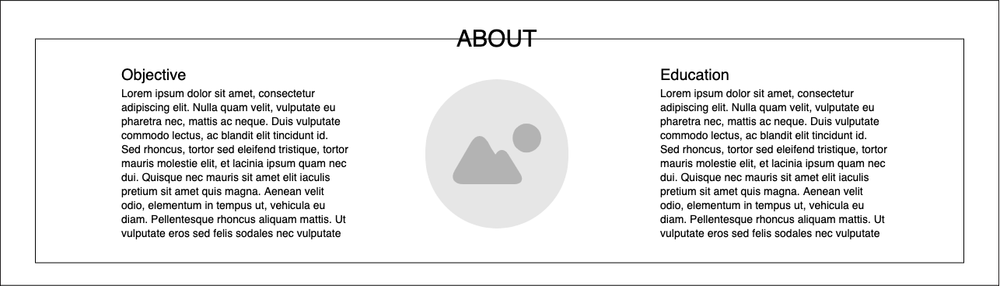
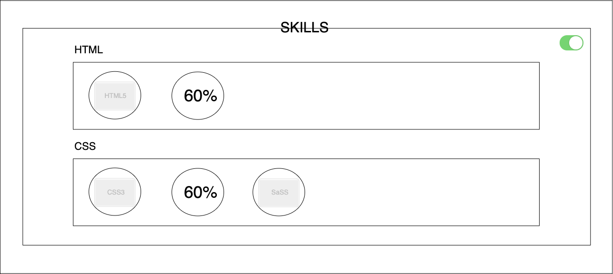
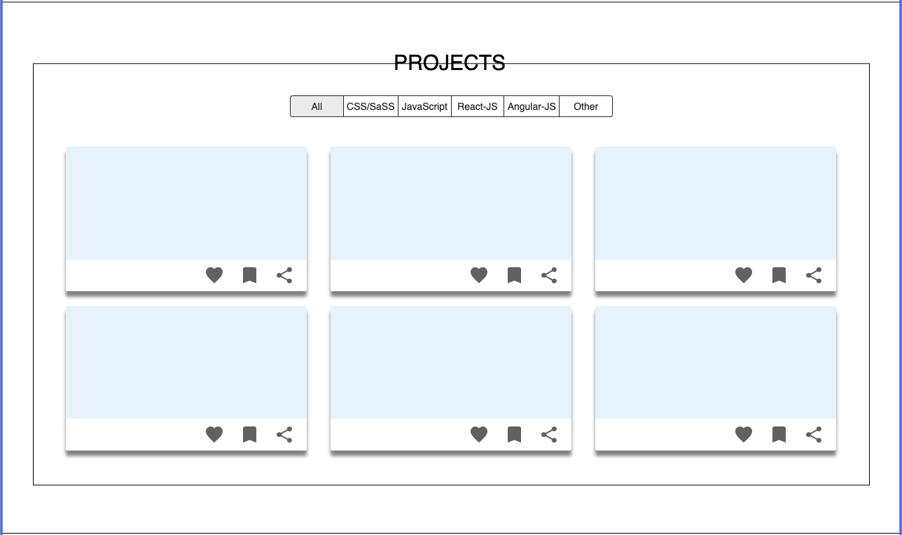
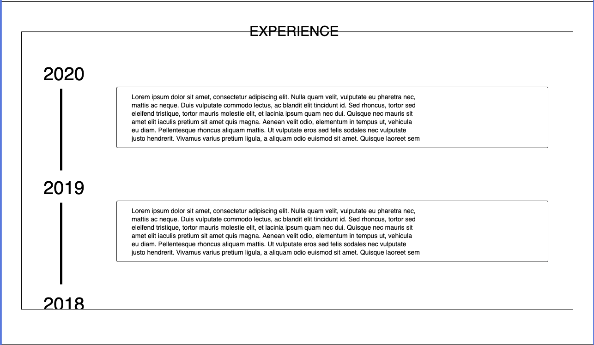
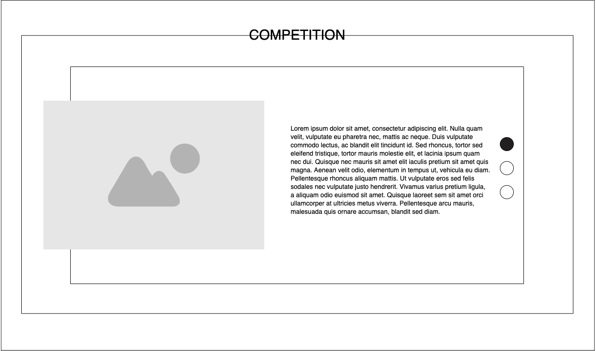
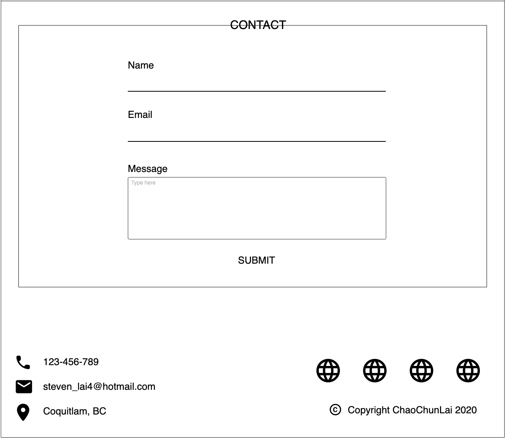

# Personal Protfolio

## Installation

1. Change to directory personal-portfolio:

```console
    cd personal-portfolio
```

2. Install packages:

```console
    npm install
```

3. Run the app:

```console
    npm start
```

## Sections

### Nav & Banner



### About



### Skill



### Project



### Work Experience



### Competition



### Contact


